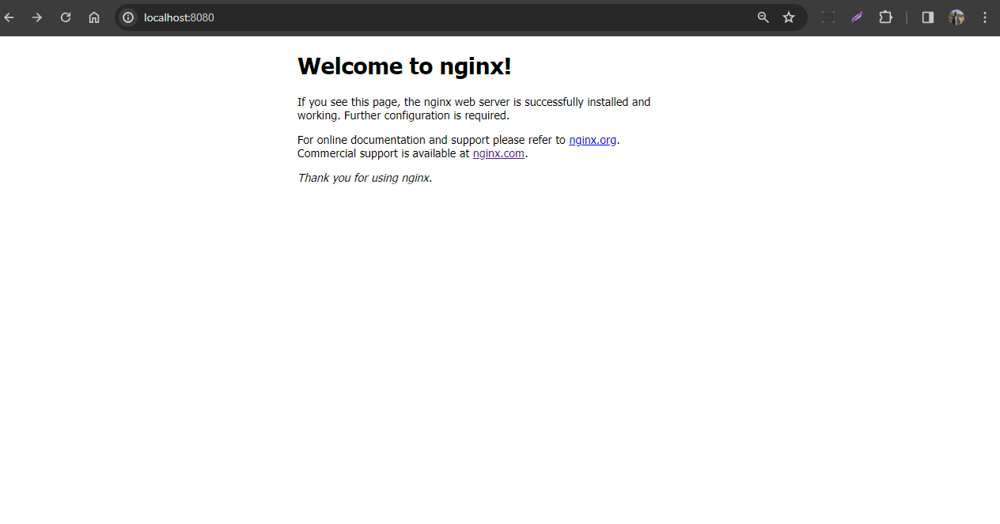

# Criando Dockerfile imagem do Ubuntu com pacote Nginx

Para criar um Dockerfile que utilize a imagem do Ubuntu e instale o pacote Nginx, você pode seguir os passos abaixo. Certifique-se de ter o Docker instalado em sua máquina antes de começar.

1. Abra um editor de texto e crie um arquivo chamado Dockerfile (sem extensão) com o seguinte conteúdo:
   

```Dockerfile
# Use a imagem base do Ubuntu
FROM ubuntu:latest

# Atualize o sistema e instale o Nginx
RUN apt-get update && \
    apt-get install -y nginx && \
    apt-get clean && \
    rm -rf /var/lib/apt/lists/*

# Exponha a porta 80 para tráfego externo
EXPOSE 80

# Inicie o Nginx durante o startup do contêiner
CMD ["nginx", "-g", "daemon off;"]

```

Salve o arquivo Dockerfile.

2. Abra um terminal na pasta onde você salvou o arquivo Dockerfile e execute o seguinte comando para construir a imagem Docker:

```bash 
docker build -t ubuntu-nginx .
```

O comando acima cria uma imagem chamada ubuntu-nginx. Você pode substituir ubuntu-nginx por qualquer nome que desejar.

Após a conclusão da construção da imagem, você pode iniciar um contêiner usando o seguinte comando:

```bash 
docker run -p 8080:80 ubuntu-nginx

```

Este comando mapeia a porta 8080 do host para a porta 80 do contêiner. Você pode escolher uma porta diferente se preferir.

Abra um navegador da web e acesse http://localhost:8080 para verificar se o servidor Nginx está em execução no contêiner.

